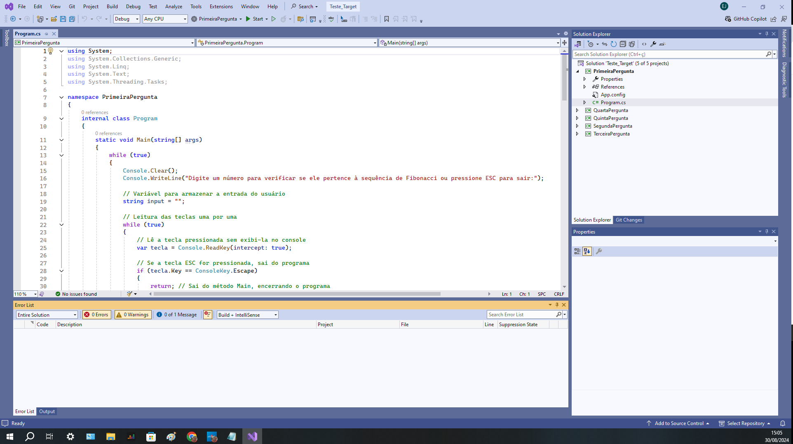

# Estágio - Ribeirão Preto

Este documento contém o teste técnico proposto para a etapa de estágio. O objetivo é avaliar suas habilidades técnicas através de uma série de exercícios. Abaixo estão os detalhes das questões propostas, juntamente com uma breve descrição do que é solicitado.

## Questões

### Questão 1: Sequência de Fibonacci
**Descrição:**
Desenvolva um programa que calcule a sequência de Fibonacci e verifique se um número informado pertence à sequência. A sequência começa com 0 e 1, e cada número subsequente é a soma dos dois números anteriores.
**Objetivo:**
- Implementar a lógica para gerar a sequência de Fibonacci.
- Verificar a presença de um número específico na sequência.
**Nota:**
Se você desenvolveu um sistema em C# console para esta questão, o programa deve permitir ao usuário informar um número e verificar se ele está na sequência de Fibonacci.

### Questão 2: Contagem de Letras
**Descrição:**
Crie um programa que verifique a presença da letra 'a' (maiúscula ou minúscula) em uma string e informe quantas vezes ela ocorre.
**Objetivo:**
- Contar a ocorrência de um caractere específico em uma string.
**Nota:**
Se você desenvolveu um sistema em C# console para esta questão, o programa deve permitir ao usuário informar uma string e contar a quantidade de vezes que a letra 'a' aparece.

### Questão 3: Cálculo da Soma
**Descrição:**
Analise o trecho de código fornecido e determine o valor final da variável `SOMA`.
int INDICE = 12, SOMA = 0, K = 1;
while (K < INDICE)
{
    K = K + 1;
    SOMA = SOMA + K;
}
printf("%d", SOMA);

### Questão 4: Complete a Sequência
**Descrição:**
Complete o próximo elemento das seguintes sequências:
a) 1, 3, 5, 7, ___
b) 2, 4, 8, 16, 32, 64, ____
c) 0, 1, 4, 9, 16, 25, 36, ____
d) 4, 16, 36, 64, ____
e) 1, 1, 2, 3, 5, 8, ____
f) 2, 10, 12, 16, 17, 18, 19, ____
**Objetivo:**
- Identificar e completar padrões em sequências numéricas.
**Nota:**
Para esta questão, foi desenvolvido um sistema de exibição que mostra as perguntas e respostas correspondentes. O sistema permite que o usuário visualize e interaja com os padrões das sequências numéricas, facilitando a compreensão e verificação das respostas.

### Questão 5: Interruptores e Lâmpadas
**Descrição:**
Você está em uma sala com três interruptores, cada um conectado a uma lâmpada em salas diferentes. Descubra qual interruptor controla qual lâmpada usando apenas duas idas até as salas das lâmpadas.
**Objetivo:**
- Resolver um problema de lógica com restrições.
**Nota:**
Um sistema de exibição foi desenvolvido para apresentar as perguntas e soluções relacionadas a este problema. O sistema permite que o usuário visualize a lógica para determinar qual interruptor controla cada lâmpada com base em uma abordagem prática e lógica.

### Ferramenta utilizada
. IDE - Visual Studio 2022,
. C#

 
<h1 align="center">
    
</h1>
